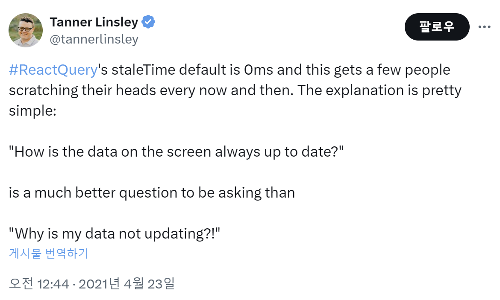

# Table of Contents

1. [Introduction to React Query](#introduction-to-react-query)
2. [First Project! Blog-em Ipsum](#first-project-blog-em-ipsum)
3. [Adding a Query Client and Provider](#adding-a-query-client-and-provider)
4. [Creating Queries with useQuery](#creating-queries-with-usequery)
5. [Handling Loading and Error States](#handling-loading-and-error-states)
6. [React Query DevTools](#react-query-devtools)
7. [staleTime vs gcTime](#staletime-vs-gctime)

# Introduction to React Query

## Client State vs. Server State

- Client state: information relevant to browser session
  - example) user's chosen language or theme on browser
- Server state: information stored on server
  - example) blog post data from database
  - it can be persisted to multiple clients

## What problem does React Query Solve?

- **React Query maintains cache of server data on client**
  - when you fetch server data, do it via React Query
  - React code <-> React Query cache <-> Server

## React Query Manages Data

- indicate when to update cache with new data from server
  - imperatively: invalidate data
  - declaratively: configure how (e.g. window focus) & when to trigger a re-fetch

```json
"key": ["blog-post"],
"data": [
  {
    "title": "React Query",
    "tagLine": "What is this thing?"
  },
  {
    "title": "React Query Mutations",
    "tagLine": "Not just for ninja turtles"
  }
],
"staleTime": "30 seconds"
```

## Plus..

React query comes with a lot of other tools to help you with your server state management.

1. Loading / Error states
2. Pagination / infinite scroll
3. Prefetching
4. Mutations
5. De-duplication of request
6. Retry on error
7. Callbacks

## Review

클라이언트 상태와 서버 상태의 차이는 **어디에 저장하는지**에 있다고 생각할 수 있다.

- 클라이언트 상태: 브라우저의 세션, 로컬스토리지, 쿠키에 저장되는 정보
  - 사용자가 선택한 언어 혹은 테마가 해당될 수 있다.
- 서버 상태: 서버의 데이터베이스에 저장되는 정보
  - 사용자가 업로드한 게시물 등이 해당될 수 있는데, 모든 사용자들에게 동일한 데이터가 지속되어져야 한다.

React Query는 어떤 문제를 해결할 수 있을까?

- 단순하게 생각하면, React Query는 클라이언트에 **서버 상태를 캐싱**해두어 유지하는 역할을 한다.
- 추후에 staleTime에 대해 배우겠지만, 캐시에 서버 상태가 저장되어 있다면 서버에 데이터를 요청하는 것이 아닌 캐시에서 데이터를 가져와 사용자에게 보여줄 수 있기 때문에 UX를 향상시킬 수 있다.
  - 성능 개선

# First Project! Blog-em Ipsum

- Gets data from https://jsonplaceholder.typicode.com/
- Very simple, focus on React Query concepts
  - Fetching data
  - Loading / error states
  - React Query dev tools
  - Pagination
  - Prefetching
  - Mutations

## Getting Started

- Create query client
  - Client that manages queries and cache
- Apply QueryClientProvider
  - Provides cache and client config to children
  - Takes query client as the value
- Call useQuery
  - Hook that queries the server

## Review

`QueryClient`는 캐시와 상호작용하기 위해 사용되어질 수 있다.

- defaultOptions: 이 queryClient를 사용하는 모든 쿼리들과 뮤테이션들을 위한 default 속성을 정의한다.
- queryCache: 클라이언트가 연결된 쿼리 캐시를 나타내는 옵션이다.
- mutationCache: 클라이언트가 연결된 뮤테이션 캐시를 나타내는 옵션이다.

애플리케이션 내부에서 `QueryClient`를 연결하고 제공하기 위해서는 최상위에 `QueryClientProvider` 컴포넌트를 사용해야 한다. 이후, `useQuery`를 호출하여 서버 데이터를 받아올 수 있다.

클라이언트에서는 쿼리들과 캐시를 관리한다.

# Adding a Query Client and Provider

## Ready Query Setup

- Create Query Client, which contains cache and tools
- Add Query Client Provider
  - Takes Query Client as prop

```tsx
import { QueryClient, QueryClientProvider } from "@tanstack/react-query";

const queryClient = new QueryClient(); // L3

const App = () => {
  return (
    <QueryClientProvider client={queryClient}> // L7 ...</QueryClientProvider>
  );
};
```

- L3: This is where we would put our options for the query client, but we're just going to accept the default options for now.

  - 현재는 기본 옵션을 받아서 사용하고 있지만, 옵션이 많아지게 될 경우와 중앙에서 에러 핸들링을 진행하게 될 경우에는 queryClient를 외부 파일로 분리하여 관리하는 것도 좋은 방법이 될 수 있다.

- L7: So any of these descendants are now going to have access to this query client, which contains the cache and all the other tools for react query.

# Creating Queries with useQuery

```tsx
import { useQuery } from "@tanstack/react-query";

const { data } = useQuery({
  queryKey: ["posts"],
  queryFn: fetchPosts,
});
```

**The query key is what defines this data within the query cache.** The query key is always an array, at least in react query version four and above.

**query function is the function that's going to run to fetch the data.** The function that we're going to use here is the fetch posts function, which conveniently has already been imported for us in the `post.js` file.

currently, it says cannot read properties of undefined reading map. And what that means is that data is undefined. And that makes sense because **data is only defined after fetch posts has returned.**

And **fetch posts is an asynchronous function that is going to take some amount of time to return**. Before that happens, this data is going to be undefined.

## Review

- query key는 쿼리 캐시에 저장되어 있는 데이터를 정의하는 것.
  - 쿼리 키는 항상 배열로 구성된다. (React Query Version 4 ↑)
- 쿼리 함수는 데이터를 fetching 하기 위해 실행되어지는 함수이다.
  - 쿼리 함수를 이용해 데이터를 받아올 때, 처음에 undefined가 출력되게 되는데, 이는 fetching 함수가 비동기적 함수이기 때문이다.
  - 그렇기 때문에, isLoading을 통해 fetching 되기 전까지는 로딩 indicator를 표시해주는 것이 에러를 방지할 수 있다.

# Handling Loading and Error States

## isFetching vs isLoading

- isFetching
  - the async query function hasn't yet resolved.
  - We haven't yet completed, in this case our fetch, but it could also be an Axios call or some sort of GraphQL call as well that is fetching.
- isLoading
  - no cached data, plus isFetching
    - isLoading = no cached data + isFetching

That's the difference between isFetching and isLoading. In this case, it might not seem to make that big a difference. but as we look at pagination, we'll see that we really want to distinguish between when we have cached data and when we don't.

## Review

- isFetching
  - 비동기 함수가 해결되었는지에 대한 Boolean 값을 반환한다.
  - 만약 아직 비동기 함수가 완료되지 않았다면 True, 완료되었다면 False
- isLoading
  - isFetching에 cached data가 없는 경우 isLoading 상태이다.

Blog-em Ipsum 프로젝트에서는 isFetching과 isLoading간에 차이가 다소 크게 느껴지지 않을 수 있다. 하지만, 페이지네이션에서 cached 데이터가 존재하는 경우와 존재하지 않을 경우에 대한 구별을 명확하게 할 수 있어, isFetching과 isLoading의 차이를 명확하게 느낄 수 있다.

페이지네이션에서 다음 페이지에 대한 prefetching이 되어 있다면 다음 페이지로 이동할 때 캐시 내부에 데이터가 존재하기 때문에 isLoading은 False이고 isFetching은 True 상태가 됨!

하지만, 다음 페이지에 대한 prefetching이 되어 있지 않다면 다음 페이지로 이동할 때 캐시 내부에 해당 페이지의 데이터가 존재하지 않아 isLoading과 isFetching 모두 True 상태가 된다.

# React Query DevTools

## React Query DevTools

- Shows queries (by key)
  - status of queries (active, inactive, stale, and so forth)
  - last updated timestamp
- Data explorer (you can look and see what data has been returned by your queries.)
- Query explorer (you can look at the queries themselves.)
- https://tanstack.com/query/latest/docs/react/devtools

the devtools are not included in production and it looks at this node environment variable to determine whether or not you're in a production environment. When you run `npm run dev` in Vite, vite sets this environment variable to be development.

So when you're running vite in development mode, the react query devtools will be included. But if you run a build, then the environment variable gets set to production. So react query devtools will not show up in the production build.

Another thing to notice is that the devtools are imported from a different package.

```typescript
import { ReactQueryDevtools } from "@tanstack/react-query-devtools";
```

They aren't imported from the react query package. It's react query devtools and this is a seperate install as well.

React Query Devtools place the following code as high in your React app as you can. The closer it is to the root of the page, the better it will work!

```tsx
import { QueryClient, QueryClientProvider } from "@tanstack/react-query";
import { ReactQueryDevtools } from "@tanstack/react-query-devtools";

const queryClient = new QueryClient();

const App = () => {
  return (
    <QueryClientProvider client={queryClient}>
      <ReactQueryDevtools />
    </QueryClientProvider>
  );
};

export default App;
```

## Review

React Query DevTools는 쿼리들을 키로 보여주고, 쿼리의 상태, 마지막으로 업데이트 된 시간을 보여준다.

devtool은 production 모드에서는 포함되지 않고, development에서만 포함된다. 그렇기 때문에, 실제 프로젝트에서 devtools를 적용하더라도, build를 하게 되면 보여지지 않게 된다.

그리고 중요한 점이 devtools는 `@tanstack/react-query`에 포함된 모듈이 아닌, 다른 패키지로 부터 import 해오기 때문에 `@tanstack/react-query-devtools`를 다운받아야한다.

React Query Devtools를 사용할 때에는, Provider 자식의 최상단에 위치시켜야 다른 쿼리들을 잘 감지하여 동작한다!

# staleTime vs gcTime

## Stale Data

- What is stale data?
  - Data that is "expired" and is ready to be refetched
  - It has outlived its useful life, and it's ready to be refetched.
  - Still in the cache
    - "Stale while revalidating", It just means that the data needs to be revalidated.
- Data refetch only triggers for stale data
  - For example: component remount, window refocus
  - `staleTime` translates to "max age"
  - How to tolerate data potentially being out of date?

## Why is default staleTime set to 0?

- Tweet from Tanner Linsley, creator of React Query
  - https://twitter.com/tannerlinsley/status/1385258144549330952
    

he says react queries stale time. Default is zero milliseconds. And this gets a few people scratching their heads every now and then. The explanation is pretty simple. How is the data on the screen always up to date is a much better question to be asking.

Then why is my data not updating? In other words, by defaulting to a stale time of zero, we are always assuming that the data is out of date and that it needs to be refetched from the server. That makes it much less likely that you are going to accidentally have out of date data on the client.

## staleTime vs gcTime

- `staleTime` is for when data needs to be refetched
- gcTime is how long to keep data that might be re-used later
  - query goes into "cold storage" if there's no active useQuery
  - cache data expires after `gcTime` (default: 5 minutes)
    - how long it's been since that last active useQuery
  - after the `gcTime` elapses, the data is garbage collected

So if there's no active useQuery that is associated with the data, if the data is not currently being displayed on the page, then the query goes into cold storage, meaning it's in the cache but is not being used and its days are numbered.

The number is that GC time.

- Cache contains backup data to display while fetching

I want to go back to that concept of the cache containing data that you want to display. It's backup data.

1. Fresh and in cache: Display cached data, no refetch.
   - The `gcTime` has not elapsed. In that case, we are going to display the cached data, and we aren't going to refetch because we only refetch data when there's a trigger, like refocusing the browser window and when the data is stale.
2. Stale and in cache: Display cached data, refetch.
   - When there is a refetch trigger, we will display the cached data while we refetch the data from the server. While we fetch the most up to date version of the data from the server.
3. Not in cache: Nothing to display during refetch
   - And if the data is not in the cache, if the `gcTime` has elapsed and the data has been garbage collected, then there is nothing to display during refetch. useQuery will not return any data until the data has been fetched from the server.

## Review

stale data란 탁한 데이터로, 업데이트가 필요한 데이터라는 것을 의미. stale data는 캐시에서 존재하기 때문에 사용자가 화면에 렌더링하면 캐시에 남아있는 data를 먼저 렌더링한 이후에 refetch를 진행함

stale time은 데이터가 언제 다시 받아올 필요가 있는지를 지정하는 시간이고, gc time은 캐시내부에 있는 데이터가 만료되는 시간. 즉 캐시에서 데이터가 삭제되는 시간

## Q&A

### 만약, 현재 쿼리 데이터가 계속해서 화면에 표시되고 있는 중이라면, 시간이 지났을 때 gcTime이 동작하고 쿼리 데이터를 날리나요?

앞서 얘기했듯이, React Query에서 `gcTime` 설정은 캐시에서 **비활성 상태**의 쿼리 데이터를 얼마나 오래 보관할지를 결정하는 것입니다. 그렇기 때문에, 해당 쿼리의 데이터를 사용하는 컴포넌트가 언마운트되고, 쿼리에 대한 참조가 더 이상 없을 때 부터 gcTime을 계산한다.

### 그렇다면, gcTime은 inactive의 누적 시간으로 측정되나요?

React Query에서 `gcTime`은 누적 시간을 기준으로 하는 것이 아닌, 쿼리가 비활성 상태가 된 순간부터 측정하게 됩니다.
