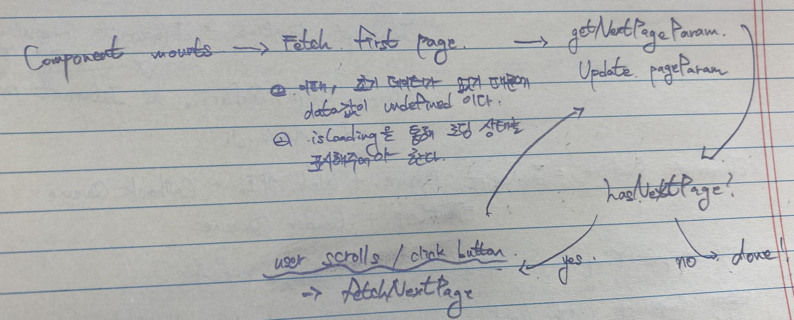
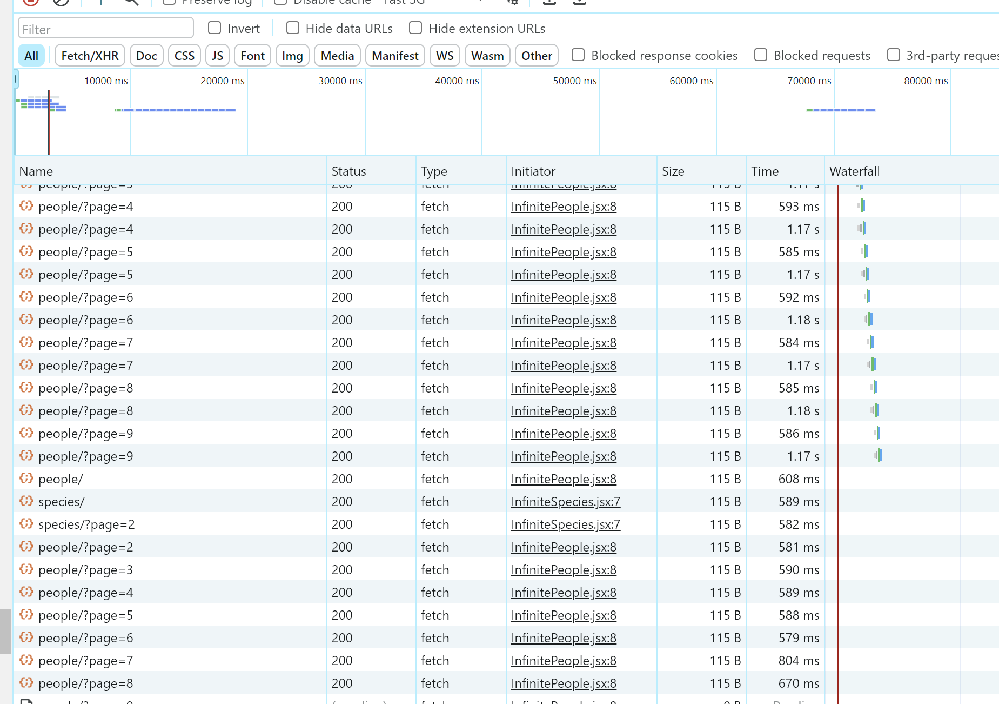
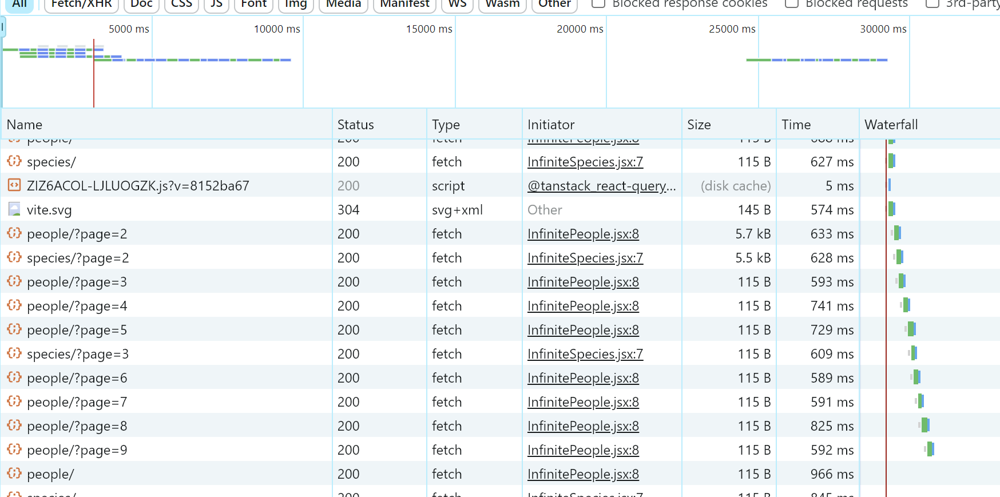

## Table of Contents

1. [Introduction to Infinite Scroll - Review](#introduction-to-infinite-scroll---review)
2. [Intro to useInfiniteQuery - Review](#intro-to-useinfinitequery---review)
3. [useInfiniteQuery Diagram - Review](#useinfinitequery-diagram---review)
4. [React Infinite Scroller - Review](#react-infinite-scroller---review)
5. [스스로하는 Q&A](#스스로하는-qa)

## Introduction to Infinite Scroll - Review

- Issue: [#15](https://github.com/BangDori/react-query-course/issues/15)

무한 스크롤은 사용자가 스크롤을 아래로 내릴 때, 새로운 데이터를 계속해서 받아와 사용자에게 보여주는 방식으로 구현되어진다.

이때, 무한 스크롤은 페이지네이션과 다른 API 포맷을 가져야 한다. [Q&A-1](#1-왜-무한-스크롤은-페이지네이션과-다른-api-포맷을-필요로할까)

페이지네이션과 달리 무한 스크롤에서는 다음 페이지 혹은 다음 스크롤에 대한 정보를 API 응답으로 전달해주어야 한다.

이는 RESTFul API의 제약 조건중 Hateoas에 해당한다.

### Hateoas란?

Hateoas란 Hypermedia As The Engine Of Application State의 약어로 클라이언트가 전적으로 서버와 동적인 상호작용이 가능하도록 한다는 것을 의미합니다.

여기서 동적인 상호작용이 가능하다는 것은 어떤 것을 의미할까요? 사용자가 서버에 어떠한 요청을 할 때, 요청에 필요한 URI를 응답에 포함시켜 반환하는 것으로, 사용자는 응답받은 URI를 통해 또 다른 상호작용을 가능하게 하는 것을 의미합니다.

그렇다면, 무한 스크롤을 할 때 Hateoas 규약을 어떻게 지킬 수 있을까요? 무한 스크롤은 사용자가 스크롤할 때 계속해서 다음 콘텐츠를 로드하는 방법으로 구현될 수 있습니다.

스크롤할 때 사용자가 계속해서 서버와 동적인 상호작용을 하기 위해서는, 서버에 컨텐츠를 요청할 때, 다음 스크롤, 세트에 대한 URI를 아래와 같이 받아옴으로 Hateoas를 지키는 무한 스크롤을 구현할 수 있습니다.

```json
{
  "count": 30,
  "next": "http://swapi.dev/api/species/?page=3",
  "previous": "http://swapi.dev/api/species/?page=1",
  "results": [ ... ]
}
```

## Intro to useInfiniteQuery - Review

- Issue: [#16](https://github.com/BangDori/react-query-course/issues/16)

useInfiniteQuery는 useQuery랑 받아오는 데이터의 모양이 다르다. useInfiniteQuery의 경우에는 `pages`와 `pageParams`를 사용한다.

- `pages`배열에 모든 쿼리의 요소, 데이터들을 가지고 있다.
- `pageParams`는 반환되어지는 쿼리들의 키를 추적한다. 예를 들어, 다음 페이지 혹은 세트에 대한 URI를 추적한다.

`useInfiniteQuery` 옵션으로 `getNextPageParam`을 설정할 수 있는데, 여기서 `pageParam`의 정보를 업데이트하여 다음 쿼리 키를 추적하고 데이터를 받아온다.

다른 옵션으로는 `fetchNextPage`와 `hasNextPage`, `isFetching` 정도가 있는데 있다.

- `fetchNextPage`는 다음 페이지에 대한 정보를 fetch하는 메서드
- `hasNextPage`는 다음 페이지에 대한 정보가 있는지를 확인하기 위한 변수
- `isFetchingNextPage`는 다음 페이지를 fetching해오고 있는지 아닌지에 대한 여부를 판별해주는 함수인데, loading spinner를 보여주기 위해 사용

## useInfiniteQuery Diagram - Review

- Issue: [#17](https://github.com/BangDori/react-query-course/issues/17)



1. 컴포넌트가 마운트된다.
2. 첫 번째 페이지에 해당하는 컨텐츠를 fetch한다.
   2-1. 첫 번째 페이지에 대한 정보가 없기 때문에, `data` 값은 `undefined`로 설정된다.
   2-2. 로딩중에 데이터를 화면에 렌더링하게 되면, `data` 값이 `undefined`이기 때문에 에러가 발생하게 된다. 그렇기 때문에 `isLoading`을 통해 로딩 상태를 표시해주어야 한다.
3. 컨텐츠를 받아온 이후, `getNextPageParam`이 `pageParam`을 업데이트한다.
   3-1. `pageParam`은 다음 페이지에 대한 URI로 업데이트된다.
4. 다음 페이지의 존재하는가?
   4-1. 존재한다면, 유저의 스크롤 혹은 클릭 이벤트에 반응하여 `fetchNextPage`를 호출하고, 3번으로 되돌아간다.
   4-2. 존재하지 않는다면, 아무런 반응도 발생하지 않는다.

## React Infinite Scroller - Review

- Issue: [#18](https://github.com/BangDori/react-query-course/issues/18)

React Infinite Scroller는 `useInfiniteQuery`와 함께 잘 사용되어짐.

만약 React Infinite Scroller 컴포넌트 없이, 무한 스크롤을 구현하기 위해서는 옵저버를 직접 구현하거나 현재 스크롤의 위치를 계산하는 기능을 구현하여야 함. 하지만, 한 천재 개발자가.. React Infinite Scroller를 구현하셨으니 행복.

[react-infinite-scroller](https://www.npmjs.com/package/react-infinite-scroller)에서 해당 라이브러리에 대한 문서를 참고할 수 있다. 우선, React Infinite Scroller는 2가지의 props를 필수로 설정해주어야 한다.

1. `loadMore`: 다음 page에 대한 정보를 받아오는 메서드

   - `useInfiniteQuery`와 함께 사용할 때 `isFetching` 상태에 따라 호출하도록 하는 것이 좋다.
   - 왜냐하면 `isFetching` 상태라면 다음 페이지에 대한 정보를 받아오고 있는 중이라는 것이기 때문에, isFetching을 체크 해주지 않으면 과도한 API 요청이 발생할 수 있다. 실제로 isFetching 상태를 확인하지 않으면 아래 사진처럼 요청이 2~3번씩 가는 것을 확인할 수 있다.

   

   isFetching 상태를 확인하면 다음과 같이 1번의 요청만 생성된다.

   

2. `hasMore`: 다음 page가 존재하는지에 대한 여부

   - 다음 페이지가 존재하는지에 대한 여부는, `hasNextPage` 인자를 전달하여 존재 여부를 파악할 수 있게 해준다.

## 스스로하는 Q&A

#### 1. 왜 무한 스크롤은 페이지네이션과 다른 API 포맷을 필요로할까?

우선 페이지네이션과 무한 스크롤은 사용자 인터페이스에서 컨텐츠를 표시하는 다른 접근 방식입니다. 이 두 방식은 UX와 백엔드에서 데이터를 로드하는 방식에서 차이가 존재하기 때문에, 서로 다른 API 포맷을 필요로 합니다.

우선 페이지네이션의 경우 컨텐츠를 명확하게 구분된 여러 페이지로 나누는 방식이기 때문에, 명시적으로 다음 페이지나 특정 페이지 번호를 선택하여 추가 컨텐츠를 볼 수 있습니다. 이때, 페이지네이션 API 포맷에는 다음과 같은 정보가 필요합니다.

- 페이지 번호: 현재 페이지를 식별할 수 있는 번호
- 페이지 크기: 한 페이지에서 표시할 컨텐츠의 개수

무한 스크롤은 사용자가 스크롤할 때마다 자동으로 다음 컨텐츠를 로드하는 방법입니다. 이는 사용자가 페이지 번호를 클릭할 필요 없이 스크롤을 통해 자연스럽게 추가 컨텐츠를 탐색할 수 있게 해줍니다. 무한 스크롤 API 포맷에는 다음과 같은 정보를 필요로합니다.

- 오프셋 또는 커서: 이전 로드에서 마지막으로 검색된 아이템을 기준으로 다음 컨텐츠의 시작점
- 로드할 컨텐츠의 수: 한 번에 로드할 컨텐츠의 수

API 포맷이 다른 이유는 컨텐츠를 로드해오는 두 방식이 서로 다른 사례와 사용자 경험을 목표로 하기 때문입니다.
