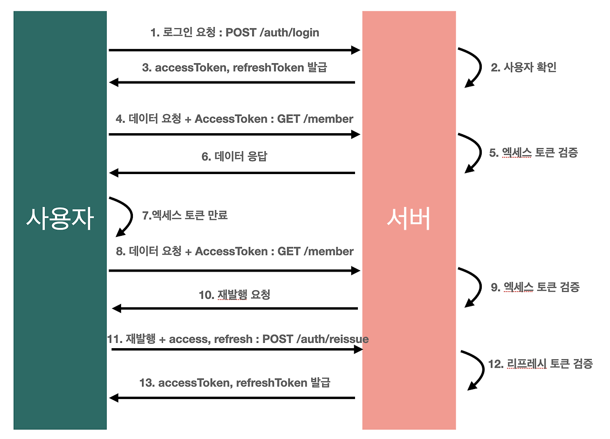

## Table of Contents

1. [Intro to React Query and AUthentication - Review](#intro-to-react-query-and-authentication---review)
2. [Why store userID and token twice? - Review](#why-store-userid-and-token-twice---review)
3. [스스로하는 Q&A](#스스로하는-qa)

## Intro to React Query and AUthentication - Review

- Issue: [#37](https://github.com/BangDori/react-query-course/issues/37)

base-lazy-days 프로젝트에서는 JWT를 이용하여 사용자 인증을 진행한다. [JWT에 대해](#1-jwt에-대해)

## Why store userID and token twice? - Review

- Issue: [#38](https://github.com/BangDori/react-query-course/issues/38)

사용자 정보를 Auth Context에 저장하고, 쿼리 캐시에는 저장하지 않는 이유가 무엇일까?

1. 지저분하며 순환적입니다.
   - 쿼리는 쿼리를 수행하기 위해 쿼리 캐시로부터 데이터를 필요로 합니다.
   - 사용자 인증 정보에 따른 데이터를 받아올 때, 쿼리 키에 사용자의 accessToken을 의존성 배열에 함께 추가해야 합니다. 하지만 query cache와 쿼리 키에 함께 저장하고 사용하게 되면 순환 구조를 가지게 됩니다.
2. 로그인 한 유저의 정보는 서버 상태가 아닙니다.
   - 로그인 한 유저의 정보는 클라이언트 상태입니다.
   - 로그인 한 유저의 정보는 브라우저에서 사용되는 언어 혹은 테마와 같이 클라이언트마다 독립된 상태를 가지기 때문에, 클라이언트에 저장합니다.

## 스스로하는 Q&A

### 1. JWT에 대해

JWT, JSON Web Token은 당사자 간에 JSON 객체로 안전하게 전송하기 위해 간결하고, 독립적인 방법을 정의하는 개방형 표준(RFC 7519)입니다. 이 정보는 디지털 서명이 되어있기 때문에, 검증되고 신뢰할 수 있습니다. JWT는 HMAC 알고리즘과 같은 암호 혹은 RSA/ECDSA를 사용하는 공개키/개인키로 서명되어질 수 있습니다.

### 2. JWT는 어떻게 구성되어져있을까?

간결한, 압축된 형태에서 JSON Web Tokens는 점(`.`)의 의해 구분된 3개의 부분으로 구성되어집니다.

1. Headers
2. Payload
3. Signature

그러므로, JWT는 전형적으로 다음과 같은 구조를 가집니다.

`xxxxx.yyyyy.zzzzz`

각 구성 요소에 대해 알아보겠습니다.

#### Header

header에는 토큰의 타입(JWT) 그리고 HMAC SHA256 혹은 RSA와 같이 서명에 사용되어지는 알고리즘 두 부분으로 구성되어집니다.

```
{
    "alg": "HS256",
    "typ": "JWT"
}
```

이후, 이 JSON은 Base64Url로 인코딩되어 JWT의 첫 번째 부분을 구성합니다.

#### Payload

토큰의 두 번쨰 부분은 cliams를 포함하는 payload입니다. Claims는 엔티티(전형적으로 유저)와 추가적인 데이터에 대한 상태입니다. 여기서 claims는 세 가지의 타입이 있습니다.

1. Registered claims

   - 유용하고 상호 운용 가능한 클레임 집합을 제공하기 위해 **필수는 아니지만, 권장되는 방법으로 미리 정의된 클레임 집합**입니다.

2. Public claims

   - JWT를 사용하는 사람들이 마음대로 정의할 수 있습니다. 그러나 충돌을 방지하려면, IANA JSON Web Token 레지스트리에 정의하거나, 충돌 방지 namespace를 포함하는 URI로서 정의해야합니다.

   ```
   {
    "https://velopert.com/jwt_claims/is_admin": true
   }
   ```

3. Private claims

   - 그것들을 사용에 동의하는 당사자 간에 정보를 공유하기 위해 만들어짐 커스텀 클레임으로, registered 혹은 public clamis가 아닙니다!

   ```
   {
    "username": "velopert"
   }
   ```

payload의 예시는 다음과 같습니다.

```
{
    "sub": "1234567890,
    "name": "John Doe",
    "admin": true
}
```

#### Signature

JSON Web Token 의 마지막 부분은 바로 서명(signature) 입니다. 이 서명은 헤더의 인코딩값과, 정보의 인코딩값을 합친후 주어진 비밀키로 해쉬를 하여 생성합니다.

예를 들어, 만약 토큰이 HMAC SHA256 알고리즘으로 사용되기를 원한다면 서명은 다음과 같은 방법으로 만들어질 수 있습니다.

```
HMACSHA256(
  base64UrlEncode(header) + "." +
  base64UrlEncode(payload),
  secret)
```

서명은 메시지가 도중에 변경되지 않았는지 검증하기 위해 사용되며, 개인키로 서명된 토큰의 경우에는 JWT를 보낸 사람이 누군지를 확인할 수 있습니다.

### 3. 언제 JWT를 사용할까?

1. **Authentication**

클라이언트가 로그인 엔드포인트를 통해 자신의 신원을 성공적으로 증명하면 인증이 완료됩니다. 성공하면, 서버는 JSON Web Token을 생성하고, 클라이언트에 대한 응답으로 전달합니다.

2. **Authorization**

인증을 위해 JWT를 기반으로 구축된 서버는 클라이언트가 로그인할 때 JWT를 생성합니다. 이 JWT는 서명되었으므로, 다른 사람이 이를 변경할 수 없습니다.

클라이언트가 보호된 리소스에 액세스할 때마다, 서버는 JWT의 서명이 페이로드 및 헤더와가 JWT가 유효한지를 결정하기 위해 검증합니다.

JWT가 성공적으로 검증되었다면, 자원에 엑세스를 허용하거나 거부할 수 있습니다.

3. **Data Exchanges**

JWT는 또한 당사자(예를 들어: 서버<->서버)간에 안전하게 정보를 전달하기 위한 좋은 방법이며, 토큰의 유효성을 검증할 수 있기 있기 때문에 서명, 구조 또는 JWT에서 주장하는 표준입니다.

### 4. JWT 인증을 사용하지 않을 경우는 언제일까?

1. **Revocable Tokens**

JWT는 데이터베이스 조회가 필요하지 않으므로 만료 전에 데이터베이스를 취소하는 것은 매우 어렵습니다.

절회는 많은 상황에서 매우 중요합니다.

예를 들어, 사용자 로그아웃 혹은 사용자를 밴할 때 또는 권한 혹은 비밀번호를 즉시 변경할 때, 토큰이 취소되어있지 않다면 해당 사용자에게 더 이상 필요한 권한이 없더라도 사용자가 계속 요청할 수 있습니다.

토큰에는 사용자 정보가 들어있는데, 사용자 정보가 변경되었다면 로그아웃을 해줘야한다. 그게 아니라면, 사용자 정보가 변경되었음에도 동일한 토큰(변경된 사용자 정보를 담고 있는 토큰이 아니라)으로 계속해서 요청이 가능해진다.

2. **Sensitive Information**

JWT는 일반적으로 데이터 조작이나 변경에 대해 보호하기 위해 서명됩니다. 이를 통해 데이터를 쉽게 읽거나 디코딩할 수 있습니다.

따라서, 데이터가 암호화되지 않기 때문에 사용자 기록이나 식별자와 같은 민감한 정보를 포함할 수 없습니다.

3. **Cookie Size Factor**

JWT의 크기는 세션 토큰의 크기보다 더 큽니다. 그리고 JWT에 더더많은 데이터를 추가하면 선형적으로 증가할 수 있습니다. 그렇기때문에 매 요청마다 JWT를 보내야한다면, payload의 크기가 커질 수 있습니다. 이것은 인터넷 연결 속도가 느리다면, 매우 복잡해질 수 있습니다.

4. **XSS Attack**

발급받은 AccessToken과 Refresh Token을 로컬 스토리지 혹은 쿠키에 저장하는 방법이 안전할까요? 무조건 안전하다고는 말 할 수 없습니다. 왜냐하면 스토리지의 접근 및 제어는 자바스크립트를 통해 이루어지기 때문에, XSS 등 스크립트 기반 공격이 가능해지게 됩니다.

JWT는 서버에서 해커가 소유한 토큰인지, 일반 유저가 소유한 토큰인지를 감지할 수 없기 때문에 탈취되게 된다면 매우 위험한 상황을 초래할 수 있습니다.

이를 해결하기 위한 방법으로는 어떤 것이 있을 수 있을까요??

- 이를 해결하기 위한 방법으로는 토큰만 사용하는 것이 아닌 HTTPS를 통해 통신 과정에 보안 레이어를 추가하는 방법이 있을 수 있습니다.
- 그리고 클라이언트 측에서 스크립팅 공격을 막기 위해 DOMPURIFY 라이브러리를 통해, 사용자가 작성한 게시물을 화이트리스트를 기반으로 XSS에 공격에 위험이 될 만한 위험들을 모두 제거하여 XSS 공격을 방지할 수 있습니다.

### 5. 왜 JWT를 사용할까?

JWT를 사용하기 이전, 세션 토큰을 통한 인증 방식에 대해 알아보겠습니다. 우선 세션 방식의 경우, 사용자가 로그인을 하였을 때 서버는 사용자의 인증 정보를 저장소에 저장하고, 클라이언트측에서는 SessionId만을 관리하게 됩니다.

이 방식은 서버에서 인증을 진행하기 때문에 클라이언트 토큰 방식보다 더 안전하다고 할 수 있습니다. 하지만, 서버에서 로그인한 사용자의 토큰 정보를 관리하고 있기 때문에 사용자의 수가 커짐에 따라 서버의 부하가 심해질 수 있다는 단점이 존재합니다.

그렇기에 클라이언트 측에서 토큰을 관리하는 JWT 방식이 유행을 끌게 되었습니다. 하지만 JWT가 항상 좋은 것은 아닙니다. 앞서 말했듯 JWT 방식은 결국, 클라이언트측에서 토큰을 보관하기 때문에 토큰이 탈취당할 경우 큰 위험을 가질 수 있습니다.

### 6. JWT의 동작 방식은 어떻게 될까?



1. 우선 사용자가 서버에 로그인 요청을 보냅니다.
2. 서버에서는 저장소에 저장된 사용자의 정보를 확인합니다.
3. 정상적으로 로그인이 되었다면 클라이언트에 accessToken과 refreshToken을 발급합니다.
4. 사용자는 인증 정보가 필요한 요청에 대해 발급받은 accessToken을 헤더에 추가하여 서버로 전송합니다.
5. 서버에서는 클라이언트에게 받은 accessToken을 확인합니다.
6. 토큰이 정상적으로 확인되면, 요청에 대한 응답을 클라이언트로 전달합니다.

7. (액세스 토큰이 만료된 경우)
8. 사용자는 인증 정보가 필요한 요청에 대해 발급받은 accessToken을 헤더에 추가하여 서버로 전송합니다.
9. accessToken을 검증합니다.
10. 토큰이 만료되었다는 응답 메시지를 클라이언트로 전달합니다.
11. 클라이언트는 refreshToken과 함께 서버에게 토큰 재발급 요청을 보냅니다.
12. 서버에서는 refreshToken을 검증합니다.
13. 검증이 완료되면, 클라이언트에게 새로운 accessToken을 발급합니다.

### 참고

- [JSON Web Token 공식 문서](https://jwt.io/introduction)
- [JWT authentication: Bset practices and when to use it](https://blog.logrocket.com/jwt-authentication-best-practices/)
- [[JWT] JWT와 JWT를 사용하는 이유](https://velog.io/@u-nij/JWT)
- [JWT + Spring Security 를 이용한 로그인 고찰 - 1](https://onejunu.tistory.com/137)
